### スタッフ管理フローによりデータのあり方

| 管理方法 | 説明 |
| --- | --- |
| 承認なし管理者がまとめて管理 | テーブルmasters.mtb_staff_masterのcurrent_data項目のみの保存するdraft_data=null, draft_status='approved' |
| スタッフ入力管理者承認・入力式の管理| スタッフ：mtb_staff_masterのdraft_dataに保存、承認後current_dataに移る。管理者入力current_dataに承認済みで保存 |
| | |


### 一時保存  

draft_dataに保存
draft_status='draft'

### 確定保存
- ① 承認ある場合  
  current_dataは本番情報を保持する
　draft_dataに保存
　draft_status='pending'  

- ② 承認
  current_data ⇐ draft_data
  draft_data=null
　draft_status='approved'   

- ③ 承認なし場合  
  current_dataに更新
  draft_data=null
　draft_status='approved'  

  
  
  

# 制御ロジック  


## マスタ管理プロセス  
お客様に下記の各プロセスから選択してもらう


### ① 先にスタッフ入力、管理者承認の場合

これは完全なワークフォローで管理となる。人数が多い、大手会社では適用されます。


| ステータス | スタッフ閲覧 | スタッフ編集 | 管理者閲覧 | 管理者編集 | 管理者承認 |
| - | - | - | - | - | - |
| draft(作成中) | ◎ | ◎ | ◎ | × | × |
| pending(提出済み) | × | × | × | × | ◎ |
| returned(差戻し) | ◎ | ◎ | ◎ | ◎ | × |
| rejected(拒絶) | ◎ | × | ◎ | × | × |
| approved(承認済み) | ◎ | × | ◎ | × | × |
| confirmed(承諾) | - | - | - | - | - |
|  |  |  |  |  |  |  


※ 情報承認時の動作（status='approved'）
- ① 既存の「本番」データは履歴にスナップショットとして移る
- ② 承認された編集データは新「本番」データになる  
上記の動作はDB　テーブルtriggerで自動的に実装済み。クライアント側はstatus='approved'にして通常保存のみ。データ保存は永久draft_dataに保存する  

※ 管理者差戻しの場合、status='returned'
※ 管理者拒否の場合、status='rejected'


### ② 先にスタッフ入力、管理者承認なしの場合

これは簡易なワークフォローで管理となる。

| ステータス | スタッフ閲覧 | スタッフ編集 | 管理者閲覧 | 管理者編集 | 管理者承認 |
| - | - | - | - | - | - |
| draft(作成中) | ◎ | ◎ | ◎ | ◎ | - |
| pending(提出済み) | - | - | - | - | - |
| returned(差戻し) | - | - | - | - | - |
| rejected(拒絶) | - | - | - | - | - |
| approved(承認済み) | ◎ | ◎ | ◎ | ◎ | - |
| confirmed(承諾) | - | - | - | - | - |
|  |  |  |  |  |  |  


※ スタッフがデータ入力し、「一時保存」するときは（status='draft'）で、「確定保存」をする時（status='approved'）はになる。  
このステータスによって上記の①、②が発火させて、「履歴」データと「本番」データが作成される。  


### ③ 先に管理者作成、スタッフ承諾の場合

これは簡易なワークフォローで管理となる。

| ステータス | スタッフ閲覧 | スタッフ編集 | 管理者閲覧 | 管理者編集 | 管理者承認 |
| - | - | - | - | - | - |
| draft(作成中) | × | × | ◎ | ◎ | × |
| pending(提出済み) | ◎ | × | ◎ | ◎ | ◎ |
| returned(差戻し) | - | - | - | - | - |
| rejected(拒絶) | ◎ | × | ◎ | × | × |
| approved(承認済み) | ◎ | × | ◎ | × | × |
| confirmed(承諾) | - | - | - | - | - |
|  |  |  |  |  |  |  

※ スタッフに入力画面のアクセス権限を与えず、管理者が入力する。データ入力データを「一時保存」するときは（status='draft'）で、「確定保存」をする時（status='pending'）はになる。  
スタッフが「承諾」する時status='approved'

このステータスによって上記の①、②が発火させて、「履歴」データと「本番」データが作成される。


### ④ 先に管理者作成、スタッフ承諾、管理者承認

これは簡易なワークフォローで管理となる。

| ステータス | スタッフ閲覧 | スタッフ編集 | 管理者閲覧 | 管理者編集 | 管理者承認 |
| - | - | - | - | - | - |
| draft(作成中) | × | × | ◎ | ◎ | × |
| pending(提出済み) | ◎ | × | ◎ | ◎ | ◎ |
| returned(差戻し) | - | - | - | - | - |
| rejected(拒絶) | ◎ | × | ◎ | × | × |
| approved(承認済み) | ◎ | × | ◎ | × | × |
| confirmed(承諾) | ◎ | × | ◎ | × | ◎ |
|  |  |  |  |  |  |  


※ スタッフに入力画面のアクセス権限を与えず、管理者が入力する。データ入力データを「一時保存」するときは（status='draft'）で、「確定保存」をする時（status='pending'）はになる。  
スタッフが「承諾」する時status='confirmed'、管理者が承認するとstatus='approved'になる。


このステータスによって上記の①、②が発火させて、「履歴」データと「本番」データが作成される。


### ⑤ 管理者が全責任で管理する場合

これは簡易なワークフォローで管理となる。

| ステータス | スタッフ閲覧 | スタッフ編集 | 管理者閲覧 | 管理者編集 | 管理者承認 |
| - | - | - | - | - | - |
| draft(作成中) | - | - | ◎ | ◎ | × |
| pending(提出済み) | - | - | ◎ | ◎ | ◎ |
| returned(差戻し) | - | - | - | - | - |
| rejected(拒絶) | - | - | - | × | × |
| approved(承認済み) | ◎ | × | ◎ | × | × |
| confirmed(承諾) | - | - | - | - | - |
|  |  |  |  |  |  |  


※ スタッフに入力画面のアクセス権限を与えず、管理者が入力する。データ入力データを「一時保存」するときは（status='draft'）で、「確定保存」をする時（status='approved'）はになる。  

このステータスによって上記の①、②が発火させて、「履歴」データと「本番」データが作成される。

---

### フロー管理について  

#### ユーザ登録、雇用契約、個人情報管理、年末調整について

- ① 管理者ユーザ登録⇒本人ログインして個人情報登録⇒管理者追加・承認（ユーザ登録画面を本人に与えない、個人情報画面の入力権限与える）
- ② 本人ユーザ登録⇒管理者スタッフ番号発行⇒本人個人情報登録⇒管理者承認(ユーザ登録画面を本人に与える、管理者スタッフ番号発行画面、個人情報画面の入力権限与える)
- ③ 本人ユーザ登録⇒本人個人情報登録（ダミスタッフコード＝ユーザID）⇒管理者追加情報・承認（管理者がスタッフコード、部門コードなどを入力）
- ④ 雇用契約マスタ関連内容の個人情報に更新する？
- ⑤ 年末調整扶養情報などの個人情報連携？
- 


---

### index.html/php内の設定  

```html
<script>
  window.appConfig = {
    userid: 'sysadmin',
    staff_code: 'sysadmin',
    staff_input: true,
    approval_request: true,
  };
</script>
```  
- ※ ログインユーザは必ずスタッフ（ダミでも必須）であること。逆にスタッフは必ずログインユーザではないかもしれない。ログインしないスタッフがあっていいから。  

ということは、原則的に、複数のログインIDは一つのスタッフでもいいということである。  


| 設定項目 | サンプル値 | 説明 |
| ---- | ---- | ---- |
| userid | sysadmin | ログインユーザID |
| staff_code | sysadmin | ログインユーザ対応スタッフ |
|  |  |  |


### マスタメンテワークフロー  

- ① スタッフが個人情報登録場合


- ② スタッフが個人情報登録しない場合


### フジ産業打刻ロジックマトリックス

#### 当日  

| -- | 出勤 | 退勤 | 打刻忘れ |
| --- | --- | --- | --- |
| 出勤 | × | ◎ | × |
| 退勤 | ◎ | × | × |
| 打刻忘れ | × | × | × |  
| | | | |  


#### 日跨ぎ  

| -- | 出勤 | 退勤 | 打刻忘れ |
| --- | --- | --- | --- |
| 出勤 | × | ◎ | ◎ |
| 退勤 | ◎ | × | × |
| 打刻忘れ | ◎ | × | × |  
| | | | |   


```text
const logicMatrix1 = [
  '出勤': {出勤: false, 退勤: true, 打刻忘れ: false },
  '退勤': {出勤: true, 退勤: false, 打刻忘れ: false },
  '打刻忘れ': {出勤: false, 退勤: false, 打刻忘れ: false },
]

const logicMatrix2 = [
  '出勤': {出勤: false, 退勤: true, 打刻忘れ: true },
  '退勤': {出勤: true, 退勤: false, 打刻忘れ: false },
  '打刻忘れ': {出勤: true, 退勤: true, 打刻忘れ: false },
]

let selectedMatrix = himatgu?logicMatrix2:logicMatrix1

Object.keys(selectedMatrix[status]).forEach(el=> {
  Document.getElementById()
})

``` 





```mermaid
graph TD
    %% ─── ルート ───
    hr_root["人事本部"]
    class hr_root active

    %% ─── 第1階層 ───
    hr_root --> hr_staff_info["スタッフ情報管理"]
    hr_root --> hr_contract["雇用契約管理"]
    hr_root --> hr_yearend["年末調整"]
    hr_root --> hr_pledges["各種誓約書管理"]
    hr_root --> hr_legal_data["法務データ関連"]
    hr_root --> hr_attendance["勤怠関連"]
    
    class hr_staff_info,hr_contract,hr_attendance active
    class hr_yearend,hr_pledges,hr_legal_data disabled

    %% ─── 第2階層 ───
    %% 法務データ関連
    hr_legal_data --> hr_legal_paidleave["有休集計一覧"]
    hr_legal_data --> hr_legal_overtime["残業時間一覧"]
    hr_legal_data --> hr_legal_orgchart["組織図"]
    class hr_legal_paidleave,hr_legal_overtime,hr_legal_orgchart active

    %% 勤怠関連
    hr_attendance --> hr_att_paidleave["有休管理"]
    hr_attendance --> hr_att_realtime["リアルタイム打刻"]
    hr_attendance --> hr_att_shift["シフト管理"]
    hr_attendance --> hr_att_shiftpattern["シフトパターン管理"]
    hr_attendance --> hr_att_defaultshift["デフォルトシフト管理"]
    hr_attendance --> hr_att_approvals["勤怠関連承認"]
    hr_attendance --> hr_att_manage["勤怠管理"]

    class hr_att_paidleave,hr_att_realtime disabled
    class hr_att_shift,hr_att_shiftpattern,hr_att_defaultshift,hr_att_approvals,hr_att_manage active

    %% ─── スタイル定義 ───
    classDef active   fill:#E60033,color:white,stroke-width:2px;
    classDef disabled fill:#777777,color:white,stroke-dasharray:5 5;

```    

status=removed,active,deactive