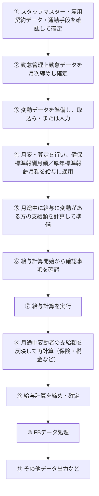

# Surupas給与計算システム仕様  

Surupas給与計算システムは下記の２つモードで運用できます。   

## 1. Surupas給与計算システム（Surupasといいます）マスター連携運用モード  
個人情報管理、雇用契約管理、通勤日管理、勤怠管理を同時の導入されているお客さまの運用モードです。 

「Surupas」は個人情報管理、雇用契約管理、通勤日管理、勤怠管理などデータと自動連携する機能を持ち、給与計算時に支持により自動的にこれらのデータ連携して来ます。

### 注意点  
- 給与計算に必要なマスタにない項目は「デフォルト値」機能を活かして給与計算を行う前に設定して下さい。例えば、新入社員の  
　　「健康保険標準報酬月額」、「厚生年金標準報酬月額」、「基本給」（契約にある場合ば不要）など

- 

## 2. Surupas給与計算システム単独運用モード  

このモード運用する場合は、個人情報管理、雇用契約管理、通勤日管理など比較的に変動のない項目を「デフォルト値」に入れておき、変動はある時「デフォルト値」上に編集して訂正します。
また、「勤怠データ」毎月給与計算をする前に取り込みします。

フジ産業様は上記の 1. Surupas給与計算システム（Surupasといいます）マスター連携運用モード  になります。

## 給与計算システムの運用フロー  

- ① スタッフマスター・雇用契約データ・通勤手段を確認して確定させます
- ② 勤怠管理上勤怠データを月次締めし確定します
- ③ 変動データを準備し、変動データを取込み・あるいは入力します
- ④ 月編・算定を行い、健康保険標準報酬月額と厚生年金標準報酬月額を給与に適用します
- ⑤ 月途中に給与に変動がある方の支給額を計算して準備します
- ⑥ 給与計算開始から確認事項を確認します
- ⑦ 給与給与計算を行います
- ⑧ 月途中に給与に変動ある方の支給額を給与計算に入れて再計算（保険・税金などの計算）
- ⑨ 給与計算締め・確定
- ⑩ FBデータ処理
- ⑪ その他データ出力など

