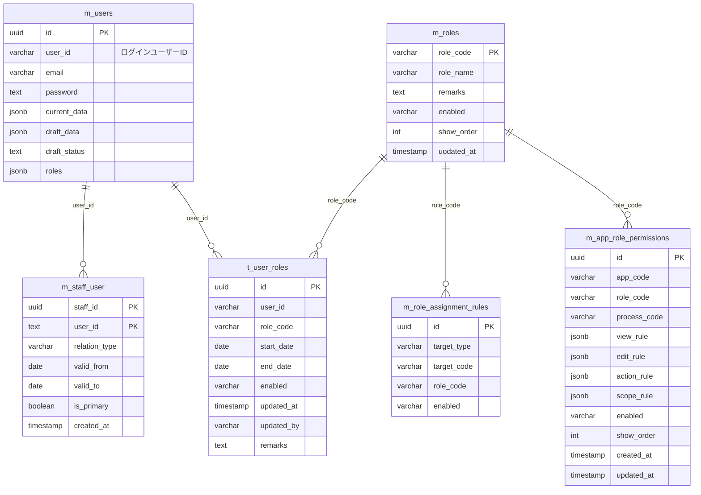

## ダイアグラム 

```mermaid
erDiagram

    m_users {
        uuid id PK
        varchar user_id "ログインユーザーID"
        varchar email
        text password
        jsonb current_data
        jsonb draft_data
        text draft_status
        jsonb roles
    }

    m_staff_user {
        uuid staff_id PK
        text user_id PK
        varchar relation_type
        date valid_from
        date valid_to
        boolean is_primary
        timestamp created_at
    }

    m_roles {
        varchar role_code PK
        varchar role_name
        text remarks
        varchar enabled
        int show_order
        timestamp uodated_at
    }

    t_user_roles {
        uuid id PK
        varchar user_id
        varchar role_code
        date start_date
        date end_date
        varchar enabled
        timestamp updated_at
        varchar updated_by
        text remarks
    }

    m_role_assignment_rules {
        uuid id PK
        varchar target_type
        varchar target_code
        varchar role_code
        varchar enabled
    }

    m_app_role_permissions {
        uuid id PK
        varchar app_code
        varchar role_code
        varchar process_code
        jsonb view_rule
        jsonb edit_rule
        jsonb action_rule
        jsonb scope_rule
        varchar enabled
        int show_order
        timestamp created_at
        timestamp updated_at
    }

    m_users ||--o{ m_staff_user : "user_id"
    m_users ||--o{ t_user_roles : "user_id"

    m_roles ||--o{ t_user_roles : "role_code"
    m_roles ||--o{ m_role_assignment_rules : "role_code"
    m_roles ||--o{ m_app_role_permissions : "role_code"
```
